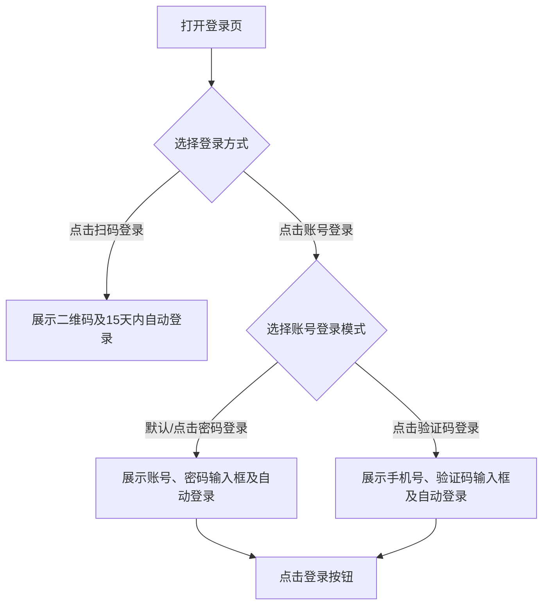

## 1. 产品概述
1:1 复刻设计图的皓峰通讯登录页项目
- 主要目的：实现一个高保真、响应式的登录页面，包含账号登录（密码登录、验证码登录）和扫码登录三种状态。
- 目标：按照提供的设计图1:1还原页面内容、布局和结构，提供流畅的用户体验和清晰的代码结构。

## 2. 核心功能

### 2.1 页面模块
1. **登录页**：包含背景、左侧插图（占位）、顶部Logo、右侧登录卡片。

### 2.2 页面详细说明
| 页面名称 | 模块名称 | 功能描述 |
|-----------|-------------|---------------------|
| 登录页 | 全局背景 | 浅蓝色渐变背景，左下角带有波纹网格装饰效果 |
| 登录页 | Logo模块 | 左上角，显示皓峰通讯Logo和文字 |
| 登录页 | 左侧插图 | 3D机器人及AI芯片插图，按要求可使用占位符实现 |
| 登录页 | 登录卡片 | 白色圆角卡片，包含标题、标签页切换、表单及操作按钮 |
| 登录页 | 标签页切换 | 支持在“账号登录”和“扫码登录”之间切换 |
| 登录页 | 扫码登录状态 | 展示二维码图片及“15天内自动登录”复选框 |
| 登录页 | 密码登录状态 | 账号输入框（带图标）、密码输入框（带图标）、自动登录复选框、验证码登录切换链接、登录按钮 |
| 登录页 | 验证码登录状态 | 手机号输入框、验证码输入框及获取验证码按钮、自动登录复选框、密码登录切换链接、登录按钮 |

## 3. 核心流程
用户打开页面，默认展示“账号登录-密码登录”状态。
用户可点击“扫码登录”标签切换到二维码展示状态。
在“账号登录”标签下，用户可通过右下角链接在“密码登录”和“验证码登录”表单之间自由切换。

## 4. 用户界面设计
### 4.1 设计风格
- **主色调**：浅蓝色背景 (`#E5F1FF` 至 `#D0E4FF` 渐变)，深蓝色文字及按钮 (`#4A78F2`)。
- **背景细节**：底部有流线型网格和紫色/蓝色发光效果。
- **按钮样式**：大圆角，蓝色渐变背景，白色文字，无边框。
- **字体大小**：标题较大且加粗（约24px），正文及输入框提示较小（约14px）。
- **布局风格**：左右分栏，居中对齐，左侧插画，右侧悬浮卡片。
- **输入框样式**：浅灰色背景，无明显边框，圆角设计。

### 4.2 页面设计概览
| 页面名称 | 模块名称 | UI元素 |
|-----------|-------------|-------------|
| 登录页 | 整体布局 | 渐变背景，左右Flex布局 |
| 登录页 | 登录卡片 | 阴影 (`box-shadow`)，圆角 (`border-radius`) |
| 登录页 | 表单输入 | 图标内嵌，自定义占位符颜色，聚焦状态高亮 |
| 登录页 | 切换动画 | 标签页下划线滑动，表单切换淡入淡出 |

### 4.3 响应式设计
- 优先适配桌面端（1920x1080）。
- 在小屏幕或移动端下，隐藏左侧机器人插图，登录卡片居中显示，宽度占满或自适应。
