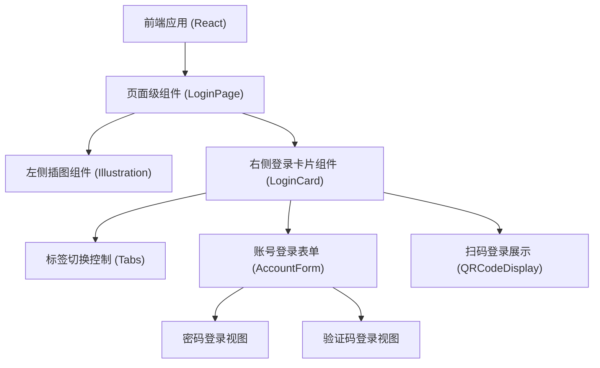

## 1. 架构设计


## 2. 技术栈说明
- 前端框架: React@18 + Vite
- 样式方案: TailwindCSS@3
- 图标库: Lucide React (用于输入框图标)
- 动画库: Framer Motion (用于页面加载、标签下划线滑动、表单切换动画)

## 3. 路由定义
| 路由 | 用途 |
|-------|---------|
| / | 默认入口，展示登录页面 |

## 4. 组件状态设计
**LoginCard 组件状态:**
- `activeTab`: 'account' | 'qrcode' (当前选中的顶级标签)
- `accountMode`: 'password' | 'code' (账号登录下的子模式)
- `formValues`: 存储账号、密码、手机号、验证码等输入值

## 5. 项目结构规划
```text
src/
├── assets/
│   └── (存放背景图、Logo、占位图等静态资源)
├── components/
│   ├── LoginCard.jsx
│   ├── AccountForm.jsx
│   ├── QRCodeDisplay.jsx
│   └── IllustrationPlaceholder.jsx
├── App.jsx
├── main.jsx
└── index.css (包含 Tailwind 引入和自定义动画变量)
```
